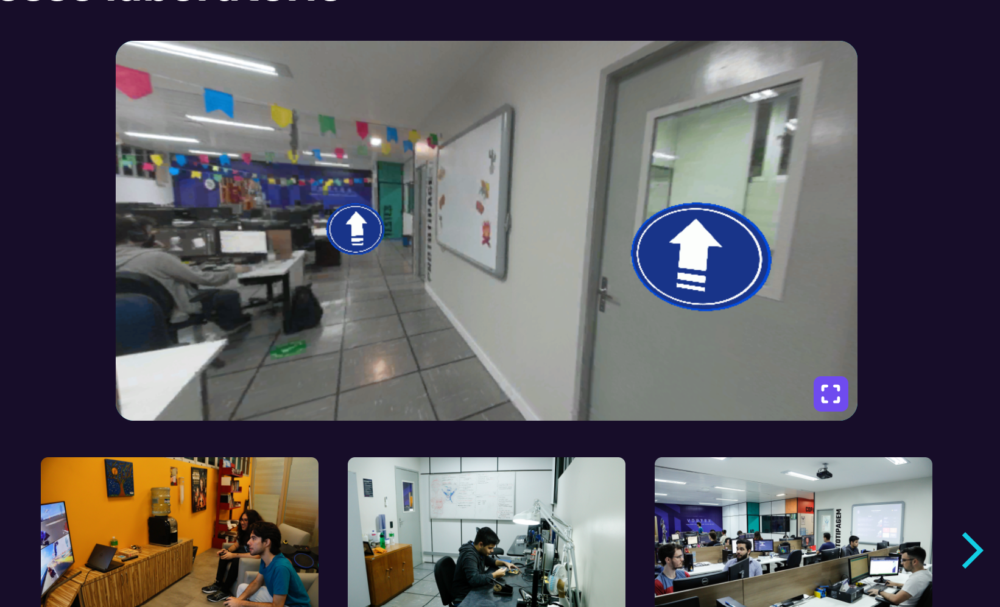

# Os Caçadores da Moema Perdida — Protótipo Vortex360

> **Versão online (WebGL):** [Link no itch.io](https://luisgustavobl.itch.io/projeto-vortex360)

Projeto desenvolvido como protótipo de navegação panorâmica interativa em 360° no ecossistema **Unity 6 (URP)** para o Desafio Técnico do Laboratório Vortex (UNIFOR).

---

## Narrativa

Durante uma expedição nas redondezas de uma histórica capela/castelo nas montanhas, a aventureira Moema desapareceu. O jogador assume o papel de um caçador de pistas navegando pela área externa, investigando panoramas para reunir os **5 fragmentos do diário** de Moema. Somente com o diário reconstituído é possível desbloquear a entrada do castelo, encontrar a Moema e resgatá-la.

---

## Funcionalidades Implementadas

- [X] **Visualização Panorâmica 360°:** Projeção esférica equirretangular via Shader URP e Cubemaps.
- [X] **Navegação Dinâmica Invertida por 6 Setores Angulares (`StreetViewManager.cs`):**
  - Botões UI permanentes (`StepUpButton` e `StepBackButton`).
  - Mapeamento contextual em **6 setores de visão** (2 setores de 90° para Frente e Trás; 4 setores de 45° para Diagonais) calculados dinamicamente a partir da variável `anguloCentralFrente` calibrável no Inspector.
  - Suporte completo a **WASD e Setas**, adaptando intuitivamente qual tecla avança ou recua no mapa de acordo com o lado exato para o qual o jogador está encarando.
- [X] **Minimapa 2D Interativo com Rastreamento em Tempo Real (`MinimapManager.cs`):**
  - Representação visual 2D da trilha/mapa no canto da tela.
  - Pino marcador do jogador (`PlayerPin`) com interpolação suave (`Vector2.Lerp`) deslocando-se entre Waypoints ancorados conforme o panorama atual.
  - Indicador de cone de visão (`VisionCone`) sincronizado em tempo real com a bússola/ângulo $Y$ da câmera.
  - Campo de compensação angular (`offsetAnguloCone`) no Inspector para ajuste fino e calibração de alinhamento com a arte do mapa.
- [X] **Controle de Câmera:** Rotação livre (Pan via mouse) com limite vertical e aproximação/afastamento (Zoom no Scroll com FOV `30-70`).
- [X] **Gerenciador de Transição de Cenas Global (`SceneTransitionManager.cs`):**
  - Objeto persistente via `DontDestroyOnLoad` com um único `CanvasGroup` e renderização em ordem prioritária (`Sort Order 9999`).
  - Carregamento assíncrono de cenas (`LoadSceneAsync`) integrado a efeitos suaves de **Fade Out** e **Fade In** (cortina preta).
  - Áudio sincronizado no início do corte de cena.
- [X] **Panorama Inicial Customizável:** Configuração de índice padrão (`indiceInicialDefault`) para início em panorama específico sem perder o ponto de retorno ao sair do castelo.
- [X] **Limite de Mapa (Feedback Visual e Sonoro):** Alerta de final de percurso com efeito *flash* vermelho, *fade out* suave controlável via Inspector e efeito sonoro de bloqueio.
- [X] **Estrutura Múltipla de Cenas com Transição Suave:** Fluxo contínuo entre `MenuScene`, `SampleScene` (Área Externa) e `CastleInteriorScene` (Interior do Castelo).
- [X] **Menu Inicial Interativo:** Fundo panorâmico 360° em rotação contínua (`MenuPanoramaRotator.cs`).
- [X] **Gatilhos Condicionais por Ângulo da Câmera:**
  - O botão de entrada no castelo (`EnterCastleButton`) só é exibido no panorama do castelo quando o jogador aponta a câmera diretamente na direção da porta.
  - O botão de saída e o botão de ação no interior só aparecem nos ângulos específicos das estruturas/personagem.
- [X] **Mecânica de Gamificação & Animação do Diário (`BookPanelProgress.cs`):**
  - Coleta de 5 fragmentos escondidos nos panoramas via clique 3D (`Raycast` e `Colliders`).
  - Animação individual de impacto e mola (`AnimationCurve`) ao encaixar cada peça no painel da coleção.
  - Sequência de **Fusão Mágica** ao coletar o 5º e último fragmento:
    - O painel desliza de forma fluida até o centro da tela (`anchoredPosition = Vector2.zero`).
    - Desativação automática do botão de fechar durante a fusão para evitar interrupções de fluxo.
    - Animação de pulso e transição de cor radiante/neon exclusiva nas artes dos 5 fragmentos (`slotImages`).
    - Transição perfeita para a revelação do diário completo restaurado (`CompletedBookPanel`).
  - Atualização assíncrona automática da visibilidade dos fragmentos ($1$ frame após o fim do carregamento da cena).
  - Contador de progresso condicional na HUD (`3/5`), ativado somente após a primeira coleta.
  - Trava de segurança no castelo: tentar entrar sem o diário completo exibe o aviso temporário *"Você não pode entrar aqui ainda!"*.
- [X] **Sistema de Áudio Centralizado & Escalas de Volume Exclusivas:**
  - Arquitetura de gerenciamento via `AudioManager.cs` e `JournalManager.cs`.
  - **Sons de Passos em Movimentação:** Array de efeitos sonoros sorteados aleatoriamente ao caminhar pelos panoramas, com controle de volume independente (`volumePassos`).
  - **Controle Fino de Áudio:** Sliders individuais no Inspector para controle de escala de volume de cliques (`volumeCliques`), erros (`volumeErroBloqueio`), passos e efeitos especiais.
  - **Sons de Coleta:** Sorteio aleatório entre arquivos de áudio de páginas/livro ao coletar um fragmento.
  - Efeito sonoro exclusivo de descoberta (`TocarDiscover`) ao revelar o diário completo e som de vitória no encerramento (`somVitoria`).
- [X] **Mecânica da Moema (Interior do Castelo):**
  - Troca de sprite/estado com delay customizável (`EmaSleeping` -> `EmaAwake`) e reprodução de som de despertar.
  - Sombra projetada no bloco (`Blob/Drop Shadow`) para garantir ancoragem visual do sprite no cenário 3D.
- [X] **Persistência de Progresso (`PlayerPrefs`):**
  - Salvamento do último panorama visitado (retorna ao panorama de origem ao sair do castelo em vez de reiniciar no ponto zero).
  - Fragmentos coletados salvos permanentemente via chaves únicas de índice ($0$ a $4$), evitando contagem duplicada.
  - Botão "JOGAR" no Menu Principal que reseta limpo os dados do `PlayerPrefs` para um novo jogo do zero.
- [X] **Tela de Vitória & Loop de Fim de Jogo (`GameWonPanel`):**
  - Painel de encerramento ativado com delay após a Moema acordar, acompanhado por efeito sonoro de vitória (`somVitoria`).
  - Botão `ReturnToMenuButton` para voltar ao Menu Principal.
  - Botão `ReturnToGameButton` para explorar livremente a sala, ativando um botão HUD fixo (`InGameReturnToMenuButton`).

---

## AI Logbook

Este projeto utilizou Inteligência Artificial Generativa (**Gemini**) como parceira de desenvolvimento (*Pair Programming*) para arquitetura de código C#, refatoração de matemática vetorial/angular, persistência de dados, design de gerenciadores de áudio e transição de cenas, animação procedural via UI e otimização de exportação WebGL.

### Histórico de Desenvolvimento e Desafios

#### **Etapa Inicial: Prototipação e Pipeline**

- **Fase 1: Rotação 360° e Input System:** Implementação da câmera rotacional (`CameraRotator.cs`). Ajuste nas preferências de entrada para URP e limites de inclinação vertical.
- **Fase 2: Gerenciamento da Rota:** Script `StreetViewManager.cs` para percorrer a lista de Cubemaps/Panoramas via teclado e UI.
- **Fase 3: Feedback de Limite de Mapa:** Implementação da Coroutine de *flash* vermelho e *fade out* suave para limites da rota.
- **Fase 4: Otimização WebGL:** Redução da build substituindo Cubemaps pesados por marcação panorâmica equirretangular `Skybox/Panoramic` com compressão para Web.

#### **Etapa 1: Arquitetura Multicenas & Posição Angular**

- **Gatilho de Visão por Bússola:** Desenvolvimento da normalização angular (`NormalizarAngulo` / `ChecarAnguloNoIntervalo`) para converter rotações negativas do Unity (ex: -90° transformado em 270°) e validar o campo de visão do jogador.
- **Fase de Interior (`CastleInteriorScene`):** Criação da cena dedicada para o interior do castelo com suporte a ângulo de entrada customizado.

#### **Etapa 2: Gamificação, Áudio Dinâmico e Navegação Contextual**

- **Sistema de Coleta e Diário (`JournalManager.cs` / `JournalFragment.cs`):** Centralização do áudio de coleta no manager com sorteio aleatório de sons.
- **Navegação Invertida Dinâmica:** Refatoração do `StreetViewManager.cs` para manter botões de navegação sempre na tela e inverter o sentido de avanço/recuo caso o jogador esteja olhando para trás no cenário.
- **Persistência de Dados entre Cenas:** Resolução do bug de reset de progresso através do uso de chaves únicas no `PlayerPrefs` (`Fragmento_X` e `UltimoPanoramaIndex`).

#### **Etapa 3: Gerenciamento Global, Polimento e Animações Procedurais**

- **Refatoração do Painel da Coleção (`BookPanelProgress.cs`):** Solução de bugs de sobreposição de canvas e centralização das coordenadas via `RectTransform`. Implementação da fusão visual com interpolação de cor e pulso exclusivo nas peças de fragmentos.
- **Implementação do Minimapa 2D (`MinimapManager.cs`):** Criação da lógica de navegação em minimapa com interpolação de pino via `Vector2.Lerp`, acompanhamento do cone de visão e sistema de `offsetAnguloCone` para calibração com a arte 2D.
- **Gerenciador de Transições Global (`SceneTransitionManager.cs`):** Componente Singleton com `DontDestroyOnLoad` responsável por controlar o `CanvasGroup` de transição e executar o `LoadSceneAsync`.

#### **Etapa 4: Refatoração de Controles e Arquitetura por Setores Angulares**

- **Solução de Duplicação de Clique (*Double Click*):** Limpeza e sincronização dos ouvintes de evento `onClick` em botões de UI para prevenir chamadas duplicadas nos métodos de movimentação.
- **Mapeamento Angular em 6 Setores (`StreetViewManager.cs`):** Substituição da lógica de inversão binária por uma arquitetura de 6 setores (2 x 90° e 4 x 45°) centralizada pela variável `anguloCentralFrente`. Esse ajuste garantiu suporte fluido às teclas WASD/Setas sem falhas ou inversões indesejadas em visões diagonais.

---

## Tecnologias Utilizadas

- **Engine:** Unity 6 (URP - Universal Render Pipeline)
- **Linguagem:** C#
- **Hospedagem WebGL:** itch.io
- **Assistente IA:** Gemini (Pair Programming e Resolução de Bugs)

---

## Créditos Autorais

- **Imagem da Moema:** Unifor
- **Foto Capela mapa (Modificado por IA):** [Capela Donaninha - Carlos Google Maps](https://www.google.com.br/maps/place/Capela+Donaninha/@-4.2296704,-38.9284619,3a,75y,90t/data=!3m8!1e2!3m6!1sCIABIhADycTjuCAVomfQGvoADrOE!2e10!3e12!6shttps:%2F%2Flh3.googleusercontent.com%2Fgps-cs-s%2FAHRPTWnzTTeLFsi4tocQLgp8EkbWZQBUu5WV7ZiCFhGUkuID_oJF86oiynPzSsiwLl8PX491QUEHAnRIHCirJMiMD4kUc0Iv5q2NSngt205HtjNhF5bCaA3CR7rMavx7bq_7weWt-5fOnWK9NNUY%3Dw114-h86-k-no!7i4000!8i3000!4m7!3m6!1s0x7bf475380bd2abf:0x1702e5ea1948f204!8m2!3d-4.2297093!4d-38.9284039!10e5!16s%2Fg%2F11cn2md8_l?entry=ttu&g_ep=EgoyMDI2MDgwNS4xIKXMDSoASAFQAw%3D%3D)
- **Ícones:** [Kenney](https://kenney.nl/assets/game-icons)
- **Efeitos sonoros:** [Pixabay](https://pixabay.com/pt/sound-effects/)

---

## Referências

- **Navegação no mundo:** [Website Vortex](https://vortex.unifor.br/about#laboratory)
